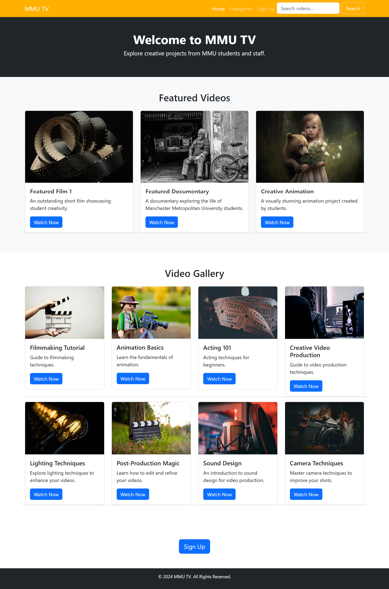
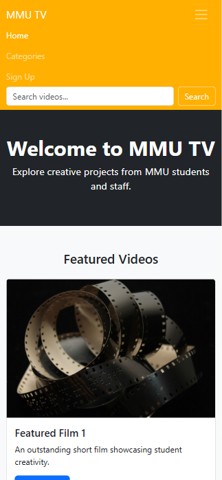

# 🎬 MMU TV: Community Media Platform
**Live Platform Prototype:** [👉 Explore MMU TV](https://marquis09.github.io/mmu-tv/index.html)

A responsive, accessible web application designed to showcase creative media, student video productions, and staff projects at Manchester Metropolitan University. Built from scratch with a mobile-first philosophy, this platform provides a centralized, intuitive interface for content discovery and community engagement.

---

## 📱 Interface Architecture & Responsive Layout

### Desktop Ecosystem

*A clean, modern layout engineered for high-visibility content delivery and balanced typography.*

### Mobile Adaptation

*Fluid grid transitions and touch-optimized navigation paths ensuring universal accessibility across all viewport sizes.*

---

## 🛠️ Core UX Engineering & Solutions

*   **Mobile-First Grid Systems:** Leveraged the Bootstrap framework alongside semantic HTML5 and custom CSS3 properties to ensure the media layout scales seamlessly down to handheld displays.
*   **Accessible Content Discovery:** Built an intuitive content-filtering layout and functional search interface designed to maximize scanability for both casual viewers and student creators.
*   **Frictionless Registration Flow:** Architected a streamlined user sign-up form with clear semantic input structures, prioritizing high completion rates and interaction simplicity.
*   **Universal Design Standards:** Maintained a strong emphasis on modern web accessibility standards ($WCAG$ alignment) to accommodate diverse university user bases.

---

## 🚀 Future Implementation Pipeline

*   **Dynamic Data Pipelines:** Integrating backend API endpoints to replace static mock assets with dynamic, high-velocity user video uploads.
*   **Secure Authentication Engines:** Upgrading the current prototype registration flow to support full session-backed user accounts and customized dashboards.
*   **Curated Content Nodes:** Developing client-side JavaScript systems allowing users to dynamically build, reorder, and save personalized video playlists.

---

## 📐 Project Logistics
- **My Role:** Web Developer & UX Designer
- **Timeline:** 3-Week Sprint Execution
- **Project Type:** University Community Platform
- **Framework Stack:** HTML5, CSS3, Bootstrap Utility Classes, Figma (UI Ideation)
